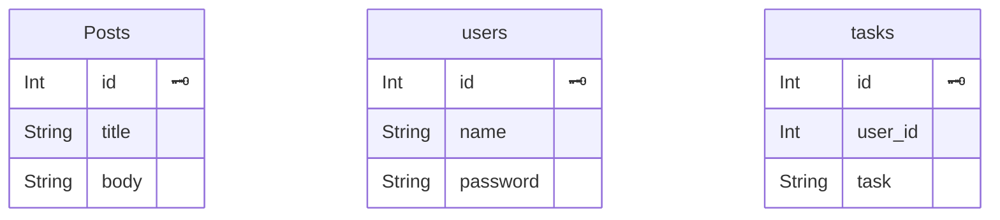

```mermaid
erDiagram

  "Posts" {
    Int id "🗝️"
    String title 
    String body 
    }
  

  "users" {
    Int id "🗝️"
    String name 
    String password 
    }
  

  "tasks" {
    Int id "🗝️"
    Int user_id 
    String task 
    }
  
```
